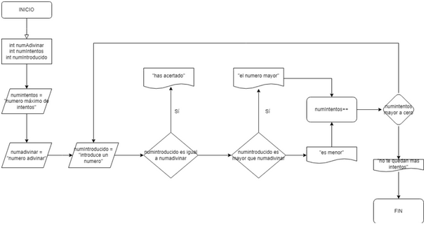
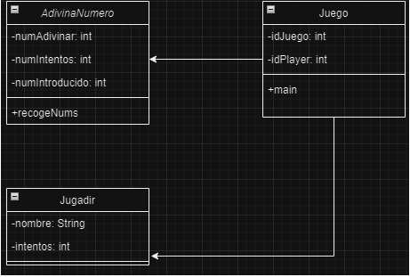

# COD --- Tarea: Repaso

##1. Realiza el diagrama de flujo con draw.io

##2. Realiza el diagrama de clases con draw.io

##3. Genera el jar
Genero el Jar desde IntelliJ. Para hacer esto hay que entrar a `Project Structure > Artifacts > +`.
Despues de eso, `Seleccionar JAR > From modules with dependencies > Main Class`
Y, por último, `Build > Build Artifacts`

##4. Etiqueta el commit en el que hiciste el jar
    Crea una release v1,0 en github
    Realiza una modificación en el boletín y vuelve a generar otro jar
    Etiqueta la modificación 
    Crea una release v2.0 en github
    Explica lo realizado incluyendo las imágenes de los diagramas en un Readme
